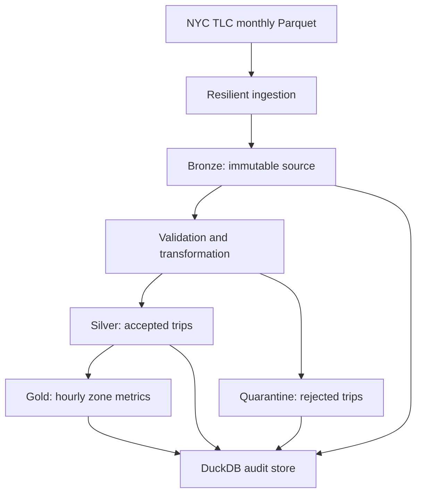

# NYC Taxi Incremental Data Pipeline

A production-style data engineering pipeline that processes official NYC taxi trip records into validated, partitioned, and analytics-ready datasets.

The project currently processes **9.55 million source records** across three monthly partitions and includes resilient ingestion, Bronze/Silver/Gold modeling, rejected-record quarantine, automated quality gates, run auditing, repeatable execution, continuous integration, and measured query-performance improvements.

## Business Problem

Transportation analysts need reliable information about taxi demand, revenue, trip patterns, and high-traffic pickup locations.

NYC publishes millions of trip records each month. Reprocessing every historical file whenever a new month arrives wastes compute and increases operational risk. Invalid records must also remain traceable instead of being silently deleted.

This project addresses those needs with a monthly incremental pipeline that:

- Processes independently partitioned source files.
- Reuses previously validated downloads.
- Preserves raw records in a Bronze layer.
- Standardizes accepted trips into Silver.
- Retains rejected records with explicit reasons.
- Produces business-ready Gold metrics.
- Reconciles row counts between every layer.
- Records pipeline runs and quality-check results.
- Runs automated linting and tests through GitHub Actions.

## Architecture



## Data Layers

| Layer | Purpose |
|---|---|
| Bronze | Preserves the original monthly Parquet source and its SHA-256 fingerprint. |
| Silver | Stores standardized, deduplicated, trip-level records that pass hard quality rules. |
| Quarantine | Retains rejected records with a documented rejection reason. |
| Gold | Aggregates accepted trips by service date, pickup hour, and pickup location. |
| Audit | Stores run status, layer counts, source reuse, errors, and observed-versus-expected quality results. |

All generated datasets are partitioned by taxi type, year, and month.

## Verified Results

Data processed: NYC Yellow Taxi trips for January through March 2024.

| Metric | Verified result |
|---|---:|
| Source records | 9,554,778 |
| Silver records | 9,551,872 |
| Quarantined records | 2,906 |
| Gold analytical records | 240,850 |
| Gold trips represented | 9,551,872 |
| Automated tests | 23 passing |
| Gold input-row reduction | 97.48% |
| Measured analytical-query speedup | 5.32× |
| GitHub Actions CI | Passing |

No records disappear between Bronze and the downstream layers:

```text
9,551,872 Silver + 2,906 Quarantine = 9,554,778 Bronze
```

All accepted trips remain represented in Gold:

```text
9,551,872 Gold represented trips = 9,551,872 Silver rows
```

## Data-Quality Strategy

### Hard rejection rules

Records are moved to Quarantine when they contain conditions such as:

- Zero or negative trip duration
- Trip duration greater than 24 hours
- Pickup timestamp outside the expected source month
- Exact duplicate records

### Soft quality flags

Some imperfect records remain analytically useful. Silver retains these records while adding flags for:

- Missing passenger count
- Zero trip distance
- Negative total amount

This approach preserves potentially valuable information without hiding known quality issues.

### Automated quality gates

Every completed pipeline run verifies:

1. Silver rows plus Quarantine rows equal Bronze rows.
2. Silver contains no duplicate generated trip IDs.
3. Silver contains no hard-rule violations.
4. Gold trip counts equal Silver rows.
5. Gold contains no duplicate analytical grains.
6. Gold trip counts are positive.

A failed stage marks the audit run as failed and records the error message.

## Incremental and Repeatable Processing

The manifest defines independently selectable monthly partitions:

```json
{
  "taxi_type": "yellow",
  "year": 2024,
  "month": 3,
  "url": "https://d37ci6vzurychx.cloudfront.net/trip-data/yellow_tripdata_2024-03.parquet"
}
```

A repeated run:

- Reuses an existing Bronze file after validating it.
- Rebuilds deterministic downstream outputs.
- Atomically replaces completed Parquet files.
- Creates a new audit record.
- Produces the same reconciled row counts.

## Technology

Implemented and verified:

- Python 3.12
- SQL
- DuckDB
- Parquet
- HTTPX
- Pytest
- Ruff
- Git
- GitHub Actions

Cloud and orchestration technologies are intentionally excluded from the implemented list until they are actually added and validated.

## Project Structure

```text
nyc-taxi-data-pipeline/
├── .github/
│   └── workflows/
│       └── ci.yml
├── config/
│   └── manifest.json
├── docs/
│   ├── 2024-01-audited-run.md
│   ├── 2024-02-audited-run.md
│   ├── 2024-03-audited-run.md
│   ├── 2024-03-end-to-end-run.md
│   ├── gold-analytics-layer.md
│   └── query-performance-benchmark.md
├── scripts/
│   └── benchmark_gold.py
├── src/
│   └── taxi_pipeline/
│       ├── audit.py
│       ├── cli.py
│       ├── config.py
│       ├── gold.py
│       ├── ingestion.py
│       ├── pipeline.py
│       ├── profiling.py
│       ├── quality.py
│       └── transformation.py
├── tests/
├── pyproject.toml
└── README.md
```

Generated files under `data/` are excluded from Git because they can be reproduced from the manifest and pipeline code.

## Local Setup

Requirements:

- Python 3.12
- Git

From PowerShell:

```powershell
py -3.12 -m venv .venv
.venv\Scripts\Activate.ps1
python -m pip install --upgrade pip
python -m pip install -e ".[dev]"
```

Verify the installation:

```powershell
taxi-pipeline --help
python -m pytest
```

## Running the Pipeline

Run one complete monthly partition:

```powershell
taxi-pipeline run --year 2024 --month 3
```

The command performs:

```text
Ingest → Bronze → Transform → Silver/Quarantine
       → Validate → Gold → Reconcile → Audit
```

Example verified output:

```json
{
  "partition_key": "yellow/2024/03",
  "source_reused": true,
  "source_rows": 3582628,
  "silver_rows": 3581457,
  "quarantine_rows": 1171,
  "gold_rows": 88990,
  "gold_trip_count": 3581457,
  "quality_passed": true
}
```

## Individual Commands

| Command | Purpose |
|---|---|
| `taxi-pipeline ingest` | Download and validate one Bronze partition. |
| `taxi-pipeline profile` | Profile a Bronze partition and identify quality conditions. |
| `taxi-pipeline transform` | Build Silver and Quarantine outputs. |
| `taxi-pipeline validate` | Run the partition quality gate. |
| `taxi-pipeline gold` | Build hourly pickup-zone Gold metrics. |
| `taxi-pipeline run` | Execute and audit the complete Bronze-to-Gold pipeline. |

Each command accepts `--year`, `--month`, `--taxi-type`, `--manifest`, and `--data-root` options as applicable.

## Performance Benchmark

Run the reproducible benchmark with:

```powershell
python scripts\benchmark_gold.py --runs 15
```

Verified local median results:

| Query source | Input rows | Median time |
|---|---:|---:|
| Silver | 9,551,872 | 0.042986 seconds |
| Gold | 240,850 | 0.008073 seconds |

The equivalent Gold query was **5.32× faster** and scanned **97.48% fewer rows**. Both queries returned identical results representing all accepted trips.

Timing is hardware- and cache-dependent. The benchmark uses one warm-up followed by the median of 15 complete executions.

## Testing and Continuous Integration

Run all automated checks locally:

```powershell
python -m ruff check src tests scripts
python -m pytest
```

Current verified result:

```text
23 passed
```

The GitHub Actions workflow runs the same Ruff and Pytest checks automatically on:

- Pushes to `main`
- Pull requests targeting `main`
- Manual workflow runs

The first verified GitHub Actions run completed successfully in 18 seconds.

## Evidence and Documentation

Detailed verified results are available in:

- [January audited run](docs/2024-01-audited-run.md)
- [February audited run](docs/2024-02-audited-run.md)
- [March audited run](docs/2024-03-audited-run.md)
- [Complete March Bronze-to-Gold run](docs/2024-03-end-to-end-run.md)
- [Gold analytics layer](docs/gold-analytics-layer.md)
- [Query-performance benchmark](docs/query-performance-benchmark.md)

## Data Source

The project uses official [NYC Taxi and Limousine Commission Trip Record Data](https://www.nyc.gov/site/tlc/about/tlc-trip-record-data.page).

## Roadmap

Potential future extensions:

- Docker-based reproducible runtime
- Workflow orchestration
- dbt-managed analytical models
- Taxi-zone dimension enrichment
- AWS S3, Glue Data Catalog, and Athena deployment
- Infrastructure as code
- Dashboard-ready semantic models

Roadmap items are not presented as completed functionality.